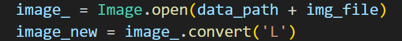

# InteloneAPISummerCompetition2023
1. [Team's Name](#teams-name)
2. [Problem Distribution](#problem-distribution)
3. [Project Distribution](#project-distribution)
4. [The Application of Intel® Extension for Scikit-learn*](#the-application-of-intel®-extension-for-scikit-learn)
5. [Experience ](#experience)
## Team's Name 
IWantToDigForOil  
## Problem Distribution  
Image recognition refers to the technology of using computers to process, analyze, and understand images to identify various patterns of targets and objects. The development of image recognition has gone through three stages: text recognition, digital image processing and recognition, and object recognition. In the field of machine learning, such recognition problems are generally transformed into classification problems.

Handwriting recognition is a common image recognition task. Computers recognize characters in handwritten images. Unlike printed fonts, different people have different styles and sizes of handwriting, which makes it difficult for computers to perform handwriting recognition tasks. Digital handwriting recognition has become a relatively simple handwriting recognition task due to its limited categories (10 digits from 0 to 9).

This experiment involves using a voting model to integrate random forest, AdaBoost, XGBoost, bagged, SVC, polynomial naive Bayes, and KNN models to classify the **MNIST** public dataset and **HWDG** private dataset, and providing experimental results and analysis.  
## Project Distribution 
1. Dataset  
There are two types of dataset, **MNIST** and **HWDG**. The first one is from http://yann.lecun.com/exdb/mnist/, which involves four files about people's handwriting digits pictures with a train set of 60,000 examples, and a test set of 10,000 examples. The other is from students who are my classmates(thanks all for your favour * 63), where 630 examples are involved.  
Below is all about how to make a HWDG dataset like MNIST.  
    1.1 check out the types of MNIST files  
    So, it's really easy to find out that there are three kinds of infomation in it where the first one is 4B(32b) size about magic number, the second is 4B size about number of items which means the differant types of dataset such as trainx, trainy, testx and testy. And the last remaining are all about pictures' lables pixels , and any of them equals to 1B.  
    1.2 change the pictures to grayscale.!  
    1.3 seperate into four files
    At this step, 500:130 is accepted, which is approximately equal to 8:2(train:test).  
    1.4 define a method the load the information of the dateset 
2. Models  
Through "import" to import some sklearn libraries, where SVC, RandomForestClassifier and etc. are involed. Below is a kind of small example. 
## The Application of Intel® Extension for Scikit-learn*  
1. Intel CPU optimizations patching for **Scikit-learn** on.
  
2. Intel CPU optimizations patching for **Scikit-learn** off.
## Experience  
As we all know, AI is often famous for its decision in many different kinds of areas, however, where there is always a big problem, in which spending plenty of time is not of good benifit when doing study, especially in machine learning and deep learning. So in this competition of Intel, there is a significant effect in accelerating the speed of computing params.   
When making a lot of codes, I've realized using InteloneAPI for AI is such a simple technology. For instance, changing original code in sklearn to sklearnex is not necessary, which enormously increases our proficiency of using. And the environment of InteloneAPI is also quite easy to creat.  
There are many other kinds of Intel oneAPI tools, like tensorflow, pytorch, and etc. So we still need more time to learn tools of oneAPI, exploring more optimizations for AI with my effort.